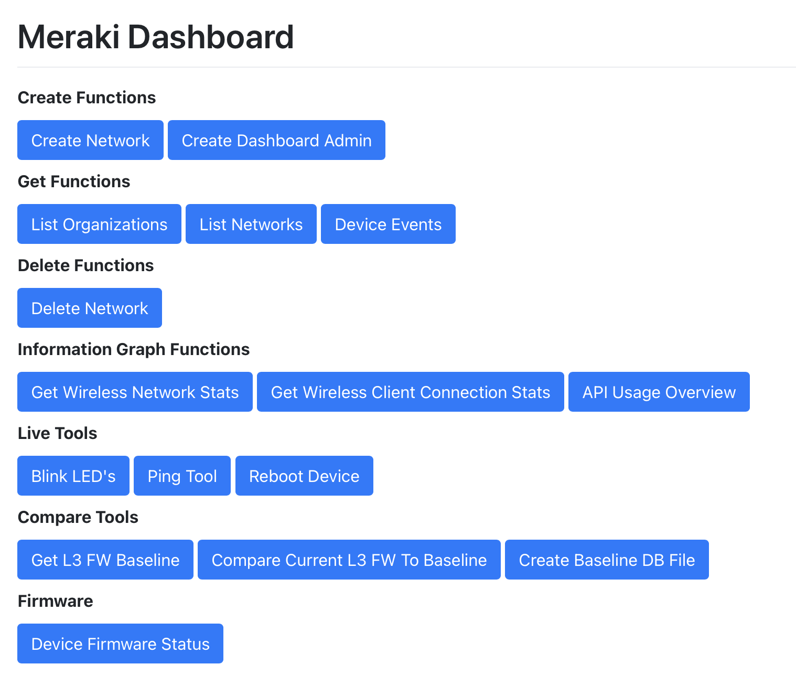
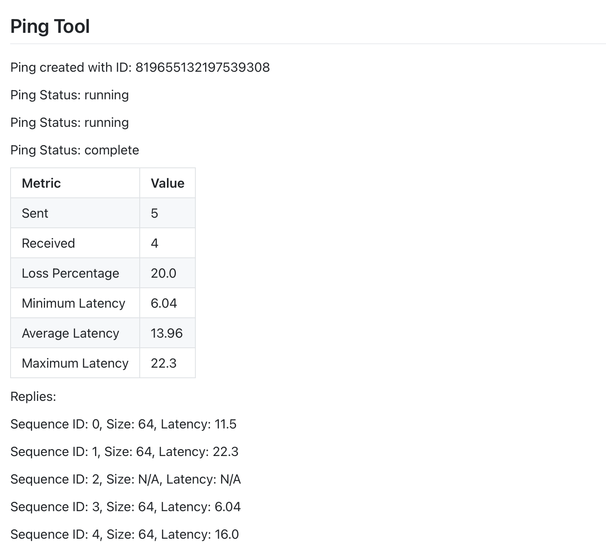

# Pyweb.IO Custom Meraki Dashboard

## Table of Contents

[**Description**](#description)

[**Requirements**](#requirements)

[**Quick Start Guide**](#quick-start-guide)

[**The Challenges and Reasons Behind Creating a Custom Dashboard**](#the-challenges-and-reasons-behind-creating-a-custom-dashboard)

[**The Solution**](#the-solution)

[**Where to begin…**](#where-to-begin…)

[**Quick Start Guides**]

[Quick Start for Provided Meraki Dashboard Script](#quick-start-guide-for-the-meraki-dashboard-script)

[Quick Start for Live Tools Dashboard Script](#quick-start-guide-for-the-live-tools-dashboard-script)

[**General Notes, Tips and Tricks:**](#general-notes,-tips-and-tricks:)

# Description

This project was published to demonstrate how any individual can create a custom dashboard utility that uses the Meraki API, Python and AI to build and present a custom front end that interacts with the Meraki platform without directly using the traditional Meraki Dashboard.

This project originated and got its inspiration from a network operation dashboard created by [Pascal Richner](https://www.linkedin.com/in/pascal-richner-61625893/) who demonstrated his implementation to the Meraki team. I was so impressed and amazed by his work that I wanted to recreate a form of it for use and education amongst the Meraki Community, thank you, Pascal.

A goal of the project is to allow you to take a copy of it and develop it yourself using your own skillsets in coding OR Assistive AI tools (for example ChatGPT) depending on your strengths. I’ve tried to keep it broad but simple so that the only limitation is your imagination on what you can create with the API tools provided.

Primary examples of this project's use cases are, the scripts can be run and created in a way that provides restricted access to people who don’t need full Dashboard access, for example:

* Think of an onsite engineer who only needs to run dashboard Live Tools access, you can easily present access to just the ping tool or blind LED tool, etc.  
* Think of a Helpdesk Manager who only needs a quick overview of wireless network connection statistics or other statistics, but does not need the entire suite of Meraki tools, you could create scripts that only show them the data points they need.  
* Think of a Level 1 helpdesk operator who you want to restrict access to certain operations, changes and tools but provide other access like managing wireless users or devices.  
* Think of a team that needs a static user experience dashboard, for example, updates to the Dashboard UI might change and break your internal process documentation, by creating your own version of the dashboard and tools you can limit UX changes to when you want them.

If you’ve seen the screenshots of this project and want to just get right into running a version of it, jump to the ***Quick Start Guides***.

If you want to start your own version of the scripts and at the same time read how I started my journey, go to the section titled “***Where to begin…***”.



Image showing the provided meraki-dashboard.py script dashboard  


Image showing a sample graph report for the Wireless Client Connection Stats


Image showing the output of the Ping Tool with a successful ping


GIF showing the API Usage Overview report function 

# 
---
# Requirements

Python (and dependant packages)  
Meraki API Key \- Do not put personal information into assistive AI tools, ie your API key  
Organization ID \- Do not put personal information into assistive AI tools  
Recommended but not required: some familiarity with scripting languages  
Recommended but not required: some familiarity with prompt engineering for AI

# Quick Start Guide

These quick start guides are provided to get you up and running with the Python scripts that I have created and shown:

[\[Quick Start for Provided Meraki Dashboard Script\]](#quick-start-guide-for-the-meraki-dashboard-script)  
This script can do the following tasks:

* Create Networks (Clone Networks)  
* Create Admins  
* List Organisations and Networks  
* Get Device Events (Seeing Devices Online\\Offline Status)  
* Delete Networks (No checks are performed, use this with Caution\!)  
* Get Wireless Network Statistics  
* Get Wireless Client Connection Statistics   
* Get API Usage Overview   
* Live Tools \- Blink LEDs, Ping, Reboot Devices  
* Layer 3 Firewall Rules Config Drift Compare Tool  
  * 1\. Run \[Create Baseline DB File\] First  
  * 2\. Run \[Get L3 FW Baseline\] Second  
  * 3\. Run \[Compare Current L3 FW to Baseline\] to see config differences  
* Get Device Firmware Status for the whole Organization

[\[Quick Start for Live Tools Dashboard Script\]](#quick-start-guide-for-the-live-tools-dashboard-script)  
This script can be used for the following live tools only

* Live Tools \- Blink LEDs, Ping, Reboot Devices

# 

# The Challenges and Reasons Behind Creating a Custom Dashboard

Building a custom dashboard for the Meraki ecosystem has always required a combination of different experiences, knowledge and skills, and an undefinable amount of time-based human resources (dev ops) that not everyone nor every organisation has easy access to.

- We can solve this challenge by utilizing Assistive AI tools to fill in the gaps in knowledge and skill and cut down time constraints by generating code.

The Meraki Dashboard has a limited scope when it comes to implementing forms of  “Rule Based Access Control” for features and functions to users who do not need the traditional full or read-only dashboard admin access, ie “Only access Live Tools for onsite engineers”

- This can be solved by scoping only the required API endpoints into a custom dashboard presenting only the tools functions and features needed in a user-friendly GUI.

Traditionally Python, Web App knowledge, an understanding of the Meraki ecosystem and its API endpoints and a committed DevOps resource have all been needed to produce a usable custom dashboard interface to meet business needs.

- This can be solved easily with Assistive AI to fill each one of those requirements

# The Solution

The solution, creating custom dashboards using the Meraki API, Python & Assistive AI (ChatGPT) resolves many of the challenges and roadblocks faced by individuals and organizations large & small with a desire to get a customised dashboard up and running. 

We can solve these problems by leveraging:

1. The Meraki API to manipulate and get data in and out of the Meraki Dashboard  
2. Any coding\\scripting skills we currently have (this will but is not necessary)  
3. If we have no experience with Python, Meraki APIs and how to read/write scripts we can use assistive AI tools like ChatGPT with detailed prompts explaining what we want to achieve and troubleshooting any errors we get along the way with the AI to build our Dashboard.

We implement the solution in these three easy steps

1. Determine our goal, in our case “Create a custom dashboard that interacts with the Meraki API using Pyweb.IO”  
2. Generate the code with detailed prompts to the AI (ChatGPT) explaining what we are doing and our goal, what it should create, look and work like, and any extra specific parameters we want, for example, colours, layouts, menus, and buttons.  
3. Troubleshoot and test while working with the AI tool to resolve any bugs or errors we encounter and continue to build out the dashboard as we want it.

# Where to begin…

This part of the guide starts from scratch to build a new dashboard, we go through the steps I used and can be replicated by you to create a dashboard from scratch using AI:

1. To start we choose a web framework to work with, in our case Pyweb.IO, you can supplement this with any other you feel free to, however, the rest of the guide is written with Pyweb.IO in mind and may not make sense.

2. We need to craft our prompt to ChatGPT, we’re going to start with a detailed prompt that outlines what we want to do in as much relevant detail for the AI which should help it give us as near an outcome to what we want.   
   *NOTE: Don’t worry about telling it “everything” in one hit, we can add features and functions as we go, just get a starting foundation and build from there. I worked by adding function to function and found this easiest to develop and troubleshoot.*

PROMPT TO CHATGPT:  
*I want to create a custom webpage that acts as a Dashboard for the Meraki API, and I want to use Python with Pyweb.IO. I want the Python script to make API calls with the Python requests package. The purpose of this custom dashboard is for users to interact with Meraki APIs with a custom front end.*

*To start with let's create a function that creates a new network in the Meraki Dashboard. This function should be an onclick option in a menu that we can add more functions to later.* 

*The “Create a Network” function should do the following things, it should use the Meraki API endpoint called **createOrganizationNetwork**, and it should ask the user for the following parameters to pass onto the API call it will make, name, notes, productTypes. The option for productTypes should be a check box and it should consist of the options, "appliance", "switch", "wireless", "camera", "sensor", "cellularGateway".*

*The script should have a variables section that is where we can paste our organization ID and API key for use within the rest of the script.*

*When we import pywebio lets import all. The script should also run in server mode on port 8999 and with debug mode true*

The output that ChatGPT 4o mini (October 2024\) provided for the above prompt is the following lines of code, in addition, it gives you an explanation of why it did this and importantly a **How to run it** guide.

*The Code*:
```bash
      from pywebio import start_server
      from pywebio.input import input, checkbox
      from pywebio.output import put_buttons, put_text
      import requests

      # Variables section
      ORG_ID = 'your_organization_id'
      API_KEY = 'your_api_key'

      # Function to create a new network
      def create_network():
         # Get user input
         network_name = input("Enter the network name:")
         network_notes = input("Enter network notes:")
         product_types = checkbox("Select product types for the network:", options=[
            "appliance", "switch", "wireless", "camera", "sensor", "cellularGateway"
         ])
         
         # Prepare payload for the API call
         payload = {
            "name": network_name,
            "notes": network_notes,
            "productTypes": product_types
         }
         
         # Make API call to create a new network
         url = f"https://api.meraki.com/api/v1/organizations/{ORG_ID}/networks"
         headers = {
            "X-Cisco-Meraki-API-Key": API_KEY,
            "Content-Type": "application/json"
         }
         
         response = requests.post(url, json=payload, headers=headers)

         # Handle the response
         if response.status_code == 201:
            put_text("Network created successfully!")
         else:
            put_text(f"Error creating network: {response.status_code} - {response.text}")

      # Main function to create the menu
      def main():
         put_buttons(['Create Network'], [create_network])

      # Start the server
      if __name__ == '__main__':
         start_server(main, port=8999, debug=True)
```

1) The first thing we need to do is read over the script we got back from the AI (it may give you a different output from what is above). 

   Check for any obvious errors, or things you don’t like/view as wrong. If Python is not your strong suit that’s okay, still have a review of what it’s done and the explanation it provided to get some learning and understanding in.

   If you find a mistake or something done incorrectly than expected it is important to correct the discovery by telling the AI what you have is wrong and what you believe it should be, it will then give you updated code to work with.

3. Copy the AI-provided code and open it in a Text Editor/IDE of your choice, then save it in your working directory as “meraki-dashboard.py”  
     
4. Update the values for [ORG\_ID](https://developer.cisco.com/meraki/api-v1/get-organizations/) and [API\_KEY](https://documentation.meraki.com/General_Administration/Other_Topics/Cisco_Meraki_Dashboard_API#Generate_API_Key) on lines 7 & 8 (line number may vary depending on your code output) with your relevant Org ID and API Key

   NOTE: It is not best practice to store your API Key in plain text, do not do this in production environments\!

   

5. Review the “How to Run” section that the AI provided. In my prompt example, it advised that we needed to have the necessary packages installed. To do this, follow what it said to do, in my case, run the following command in your terminal:

   *pip install pywebio requests*

   

   *NOTE: (if you are having trouble with OS dependencies, errors or something of that nature tell the problem to the AI it will help you)*

6. Attempt to run the script, open a terminal and change to your working directory, run the script with the command: 

   *python meraki-dashboard.py*

7. If the script ran successfully open the IP and port number provided in the terminal output in a browser, ie if you’re running this locally *https://localhost:8999*  
   1. If you get any errors when running the script, copy the error text and message the AI tool to tell it what happened and get help with troubleshooting.   
   2. For example: *“When I ran the script I got the following error: \[ERROR TEXT HERE\], can you tell me why and help me fix this?*”.

8. Test the create network function, if it works as expected you’re all done. If it does not, copy any errors you got and work with the AI tool to help troubleshoot what went wrong, updating your script as it provides updates in response.

9. Continue your journey and build out your script\! Continue to work with GPT to add functions, elements and adjustments to the script, these can be   
   1. New functions with different API endpoints  
   2. HTML Formatting  
   3. Data Analytics tools such as graphing  
   4. Python Formating, if your script is growing large ask the AI to optimize the script  
   5. Import into databases for long-term storage, reporting, management  
   6. Produce outputs like PDF reports

The key here is to continue to work with the AI by using your prompting to tell it what you want to achieve, take what it gives you back, add and validate each function works and work with the AI to fix what does not.   
If you follow this process you can build whatever you can imagine with the API tools provided.

You could even upload a copy of the *meraki-dashboard.py* script in the git repo, to ChatGPT and work with it as a foundational point to add features or change the script however you want it to be, allowing you to reverse engineer it and make it work for you.

# Quick Start Guides

## Quick Start Guide for the Meraki Dashboard Script 

This is a quick start guide to get you up and running with the dashboard script right away, you can then build it up or edit it to suit your needs.   
**NOTE:** Python must be already installed

1. Download a copy of the “*meraki-dashboard.py*” script and place it in your working directory.  
2. Open the “*meraki-dashboard.py*” script in a text editor of your choice and paste in the values for your [Organization ID](https://developer.cisco.com/meraki/api-v1/get-organizations/) and [API Key](https://documentation.meraki.com/General_Administration/Other_Topics/Cisco_Meraki_Dashboard_API#Generate_API_Key) on lines 20 and 21\.

**NOTE:** *Beware, this is not a secure API Key storage method\!* 

3. Install the following Python packages with the following commands  
   1. *pip install pywebio*  
   2. *pip install requests*  
   3. *pip install pytz*  
   4. *pip install pyecharts*  
4. In a terminal navigate to the working directory and run the command  
   1. *python meraki-dashboard.py*  
5. In a browser open the URL prompted by the application on the next line, for example: [http://localhost:8999/](http://localhost:8999/)  
6. Load the webpage and start working with the functions\!

## Quick Start Guide for the Live Tools Dashboard Script

This is a quick start guide to get you up and running with the live tools script right away, you can then build it up or edit it to suit your needs.  
**NOTE:** Python must be already installed

1. Download a copy of the “*live-tools.py*” script and place it in your working directory  
2. Open the “*live-tools.py*” script in a text editor of your choice and paste in the values for your [Organization ID](https://developer.cisco.com/meraki/api-v1/get-organizations/) and [API Key](https://documentation.meraki.com/General_Administration/Other_Topics/Cisco_Meraki_Dashboard_API#Generate_API_Key) on lines 12 and 13

**NOTE:** *Beware, this is not a secure API Key storage method\!*

3. Install the following Python packages with the following commands  
   1. *pip install pywebio*  
   2. *pip install requests*  
4. In a terminal navigate to the working directory and run the command  
   1. *python meraki-dashboard.py*  
5. In a browser open the URL prompted by the application on the next line, for example: [http://localhost:8999/](http://localhost:8999/)  
6. Load the webpage and start working with the functions\!

# 

## General Notes, Tips and Tricks:

* Try to think of the AI as an assistant or employee when you work with it. Directing it as a leader, praising it for getting things right and collaborating with it when things go wrong or get hard to figure out.

* The PywebIO scripts I provide run in server mode with debugging enabled, you’ll see this line at toward end of the scripts:   
  *start\_server(main, port=8999, debug=True)*  
  By using debug=True to enable debug mode, the server will automatically reload if the code changes.

* One possible way of avoiding storing your API key in the script is to have the script function prompt you for your key every time you run a function. You can ask the AI to update the script to do this, but often I found the AI would do this by default.

